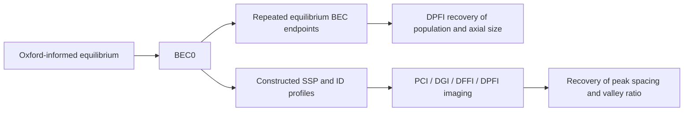
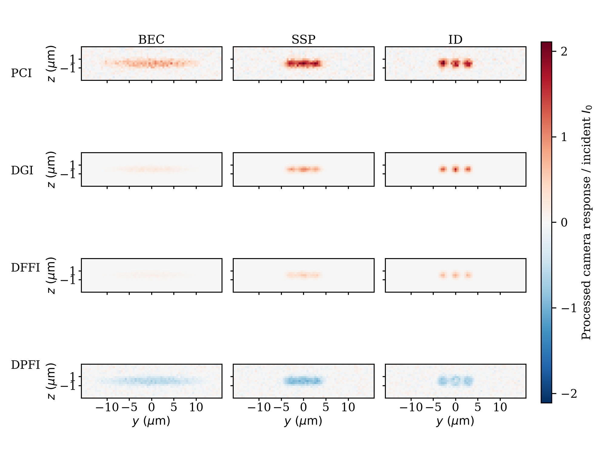
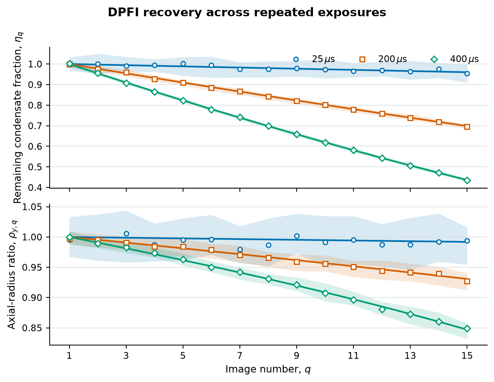
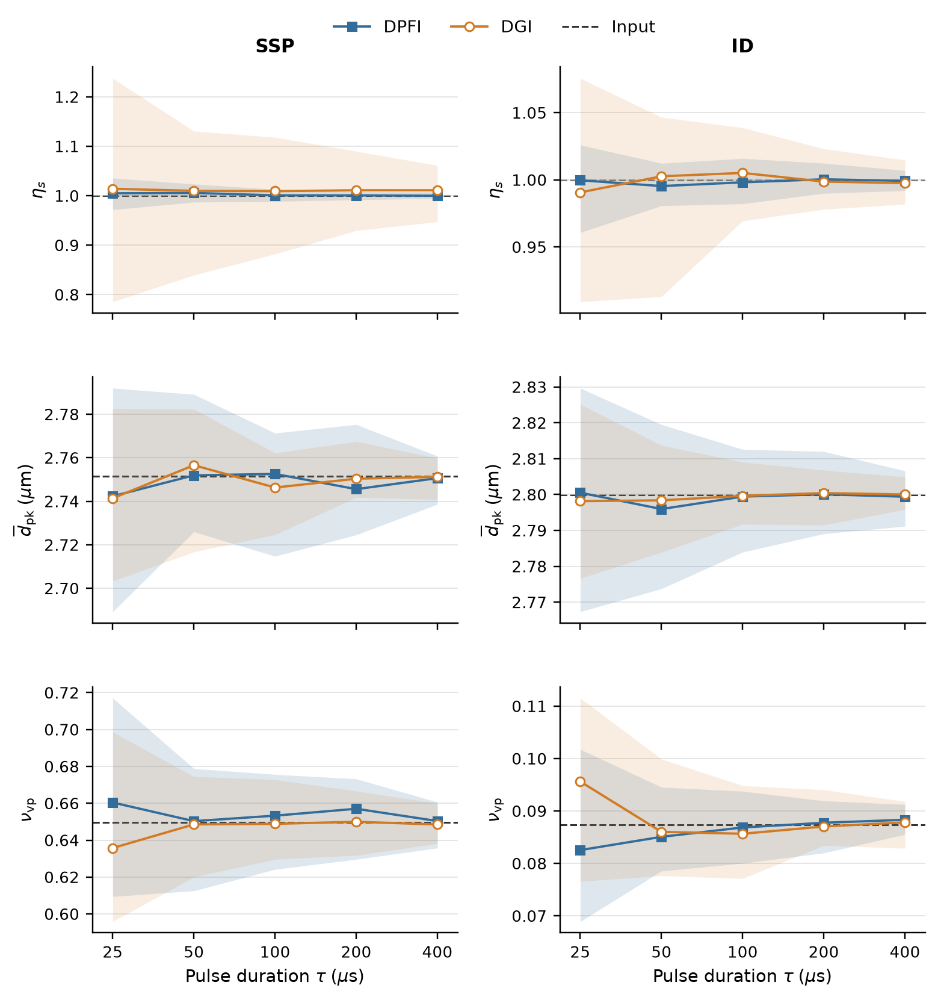

# Simulating dispersive imaging of dipolar erbium condensates

This repository accompanies the MSc dissertation *Simulating Dispersive
Imaging of Dipolar Erbium Condensates*. It is a simulation-only package for
asking what physical information can be recovered from dispersive images when
the same probe also disturbs the condensate.

The dissertation separates that question into two calculations because the
available models do not describe a pulse-affected dynamical transition from a
smooth condensate into modulated and droplet states.



The repeated-BEC route follows equilibrium endpoints after accumulated recoil
energy. The static route compares the same smooth BEC with source-informed SSP
and ID density profiles. The arrows between BEC0, SSP and ID above do **not**
represent a simulated state-transition trajectory.

## Results at a glance

The common camera model shows how the four readouts respond to the three
density objects at one representative exposure:



Repeated DPFI images can recover the population ratio and axial-radius ratio of
the smooth BEC sequence, while the recovery ceases to improve systematically
as the pulse is made longer:



For the SSP and ID, the fitted physical outputs are the visible peak spacing
and valley-to-peak density ratio. DPFI has the strongest response on the smooth
single-branch BEC, but its periodic response becomes harder to interpret at the
higher three-peak densities. DGI provides a useful second readout because its
static morphology remains more directly visible there.



These are same-model synthetic results. They are not experimental performance
measurements or a demonstration of blind density reconstruction.

## Five-minute reproduction

Use Python 3.10 or newer from the repository root:

```text
python -m venv .venv
```

Activate that environment (`.\.venv\Scripts\Activate.ps1` in Windows
PowerShell, or `source .venv/bin/activate` on macOS and Linux), then run:

```text
python -m pip install -e ".[dev]"
python scripts/run_public_example.py
python scripts/verify_bundled_evidence.py
python scripts/render_public_figures.py --check-only
```

The first command-line example takes about ten seconds on the development
machine. It recomputes the three density objects and all four readouts, then
runs one fixed-seed DPFI fit of BEC population and axial size. It reads two
repeated-BEC endpoints from the authenticated ensemble summary instead of
rerunning the slower finite-temperature sequence. Its JSON output labels this
boundary explicitly.

To save the example result without overwriting an existing file:

```text
python scripts/run_public_example.py --output output/public_example.json
```

`verify_bundled_evidence.py` checks all six admitted result families: root
manifest identities, the complete 183-file inventory, byte counts and SHA-256
digests. `render_public_figures.py --check-only` checks the 17 exact PDFs used
by the dissertation. Omitting `--check-only` collects those PDFs and writes a
machine-readable index; it does not pretend to repeat the long stochastic
calculations that produced the evidence.

## What is recomputed and what is bundled

| Part | Public treatment |
| --- | --- |
| BEC0, SSP and ID density objects | Recomputed by the public example |
| Four ideal readouts and objective/camera sampling | Recomputed by the public example |
| One noisy DPFI BEC fit | Recomputed as a fixed-seed workflow check |
| Repeated-BEC and SSP/ID recovery ensembles | Bundled as hash-verified admitted evidence |
| Exact dissertation figures | Bundled and hash-verified |
| BEC–SSP–ID transition dynamics | Not modelled |
| Experimental images or installed-apparatus validation | Not included |

The distinction matters: a successful quick-start fit checks that the released
software still follows the declared chain; it is not a new statistical result.
See [Evidence and result identity](docs/EVIDENCE.md) for the six evidence
families and [Model and limits](docs/model.md) for the physical assumptions.

## Repository map

- `src/non_destructive_image/` — density, atom–light, optical-transfer, camera
  and fitting code used by the current dissertation route;
- `configs/` — numerical contracts used by the public example and the retained
  calculations;
- `scripts/` — the three public entry points and the figure sources that map
  directly to the dissertation;
- `results/` — complete admitted evidence trees with immutable manifests;
- `dissertation/figures/` — the 17 exact figure PDFs used in the manuscript;
- `docs/FIGURES.md` — reader-facing figure crosswalk;
- `tests/` — focused model, camera, fit and release-integrity checks.

Run the focused public tests with:

```text
python -m pytest -q
```

## Scientific boundary

The optical model uses an isolated 401-nm erbium transition, a fixed
polarisation/field geometry, idealised readout elements and a measured-testbed
objective transfer. The camera model includes physical pixel integration,
photon-counting noise and read noise. The repeated-condensate calculation adds
probe recoil energy and solves for later finite-temperature equilibria, but it
does not simulate the motion between them. The SSP and ID are constructed
density profiles informed by the morphology and spatial scale reported by
Chomaz *et al.*; they are not equilibrium solutions for the Oxford trap.

For an experiment, the simulation supplies a decision method rather than a
finished optical prescription: calibrate the installed transfer and detector,
choose the physical quantity to recover, test the shortest probe setting that
recovers it adequately, and compare dispersive estimates with the Oxford RAI
system where that provides a suitable independent reference.

## Citation and licence

Citation metadata is provided in [`CITATION.cff`](CITATION.cff). Repository
code is released under the BSD 3-Clause License. External publications, the
Oxford source dataset, the group-supplied objective report and software
dependencies retain their own terms; see
[`THIRD_PARTY_NOTICES.md`](THIRD_PARTY_NOTICES.md).
