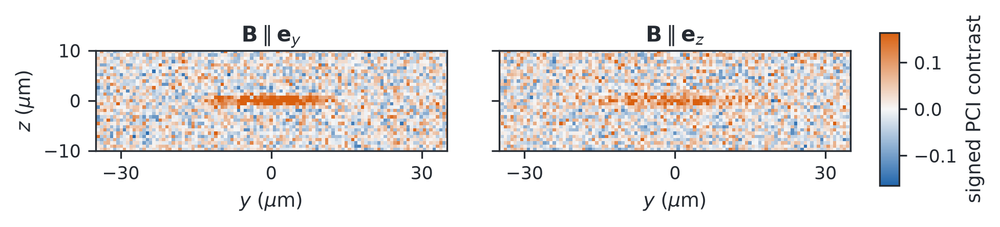
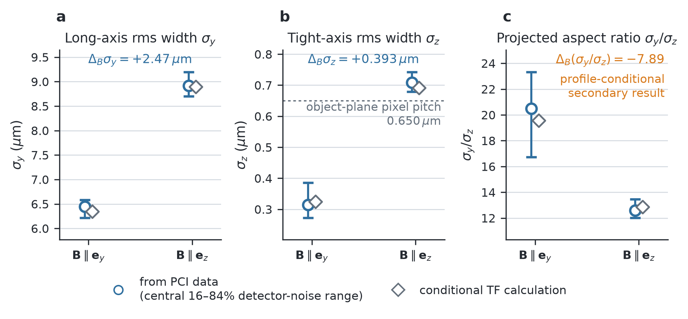

# Equilibrium-conditioned dispersive imaging

This repository is a simulation-only reproduction package for repeated
dispersive imaging of a polarised `166Er` condensate. It links a dipolar
Thomas–Fermi equilibrium model to finite-aperture optical transfer, camera
counts, conditional probe heating and low-order morphology inference.

The public surface has two complementary layers:

- re-runnable software for the deterministic forward chain and one fixed-seed
  PCI endpoint-inference workflow;
- a compact, hash-identified evidence bundle containing selected retained
  synthetic camera arrays, conditional refits, result tables and figures.

No laboratory image dataset is analysed in this repository. Selected
reference-state values are transcribed with provenance from the identified
Oxford ORA source archive, but the imaging targets and fitted results shown
below are synthetic.

## Results at a glance

Two independently generated first-exposure PCI targets show the simulated
orientation-conditioned morphology before fitting:



The retained conditional refits constrain positive fitted width contrasts
within the declared projected-profile family:



These are same-model synthetic results, not experimental magnetostriction or
independent validation of the state, profile or installed optical system. The
full interpretation boundary and machine-readable files are documented in
[evidence/retained_v1](evidence/retained_v1/README.md).

## Public coverage

| Result or workflow | Public status | Public surface |
| --- | --- | --- |
| Dipolar equilibrium, optical response and conditional sequence | Recomputed | Deterministic forward driver and software-verification reference |
| Fixed-seed PCI endpoint fit | Recomputed as a workflow check | One independently generated pair with four-start fitting |
| Linked first/second-exposure PCI result | Bundled retained evidence | Synthetic raw target, 64-refit route data, status matrix and residual diagnostics |
| Independent orientation PCI result | Bundled retained evidence | Two synthetic raw targets, endpoint and route tables, and 64 conditional refits per endpoint |
| 17-point PCI/DGI scans and slope regressions | Not retained | No plotted values are reconstructed from the dissertation |
| Profile-qualification presentation, thermal-halo stress and later-exposure fits | Not retained | Their manuscript conclusions are not promoted to public numerical evidence |
| Experimental imaging data | Not part of this reproduction | The ORA archive only anchors selected declared reference values |

See [docs/results.md](docs/results.md) for the precise evidence classes and
claim boundaries.

## Quick start

Use Python 3.12 in a fresh environment, then run from the repository root:

```text
python -m pip install ".[test]"
python -m pytest -q
python scripts/reproduce_forward_model.py --validate-only
python scripts/reproduce_inference.py --validate-only
python scripts/check_reference.py
python scripts/check_evidence.py
```

Use the tagged GitHub source archive or a repository checkout: the scripts,
configurations and evidence files are source-tree assets, so this release is
not advertised as a standalone PyPI distribution.

A successful run prints both validation messages and two `PASS` messages:

```text
configuration and forward-model contract validated
configuration and inference contract validated
PASS forward (...)
PASS evidence (16 files, 2366025 bytes)
```

The default reference check covers the deterministic forward-model reference.
To include the fixed-seed PCI endpoint fit, run:

```text
python scripts/check_reference.py --include-inference
```

The inference check is optional because it is slower. `check_reference.py`
recomputes software-verification values. `check_evidence.py` performs no fitting
or scientific calculation; it verifies the frozen evidence inventory, byte
counts, SHA-256 digests, CSV row counts and NPZ schemas.

## Generate local JSON outputs

The public drivers keep validation separate from writing output:

```text
python scripts/reproduce_forward_model.py --output outputs/forward_model.json
python scripts/reproduce_inference.py --draws 1 --output outputs/inference.json
```

Existing output paths are refused by default. Pass `--overwrite` only after
inspecting the file you intend to replace.

What you should see:

- `outputs/forward_model.json` has status
  `model_conditional_reproduction` and records the two independently minimised
  equilibrium endpoints, optical response, mean raw counts, scattering and the
  conditional thermodynamic sequence;
- `outputs/inference.json` has status
  `fixed_seed_point_fits_not_sampling_coverage`, records one fixed-seed draw by
  default, and states that generator truth was not used by the fit;
- rerunning with unchanged inputs reproduces the deterministic forward payload
  and seed policy. Generated files remain local software artefacts and do not
  replace the immutable evidence bundle.

The two endpoints, `B_parallel_y` and `B_parallel_z`, are independent
equilibrium states under a common PCI design. They are not a simulated magnetic
field-rotation trajectory. The repeated-exposure update is likewise conditional:
it assumes fixed trapped number, recoil-only deposited energy and complete
re-equilibration between exposures.

## Repository map

- `src/non_destructive_image/`: physical, detector and inverse models;
- `configs/`: frozen numerical inputs and source-data identity;
- `scripts/`: validation, reproduction and integrity-checking entry points;
- `tests/`: unit, contract and release-surface tests;
- `evidence/retained_v1/`: selected admitted synthetic targets, fitted
  summaries, figures and provenance;
- `reference/`: compact software-verification values;
- `docs/`: model, inference, result-boundary and reproduction documentation;
- `THIRD_PARTY.md`: data, article and dependency attribution.

The Oxford ORA dataset identified by DOI `10.5287/ora-m8gpvdr2y` is not bundled.
Only values required by the public drivers are transcribed into configuration
with provenance and integrity metadata. The drivers do not access the network
or the archive. See `THIRD_PARTY.md` before obtaining or redistributing the
original dataset.

## AI-assisted development

OpenAI Codex (5.6 Sol) was used for selected implementation tasks, codebase
organisation and maintenance, and code review. Suggestions adopted into the
repository were reviewed by the author and, where applicable, checked using the
repository's tests and validation workflows. The scientific model, numerical
methodology and interpretation of results were determined by the author, who
remains responsible for the code and its outputs.

## Identity, citation and licence

Version `1.1.0` retains runnable source snapshot commit
`afc8050fbe86c7ce5741fec608bb354591790f03` and adds the selected retained
synthetic evidence bundle. Citation metadata is in `CITATION.cff`.

The repository code is released under the BSD 3-Clause License; see `LICENSE`.
Third-party data, publications and dependencies remain governed by their own
terms.
